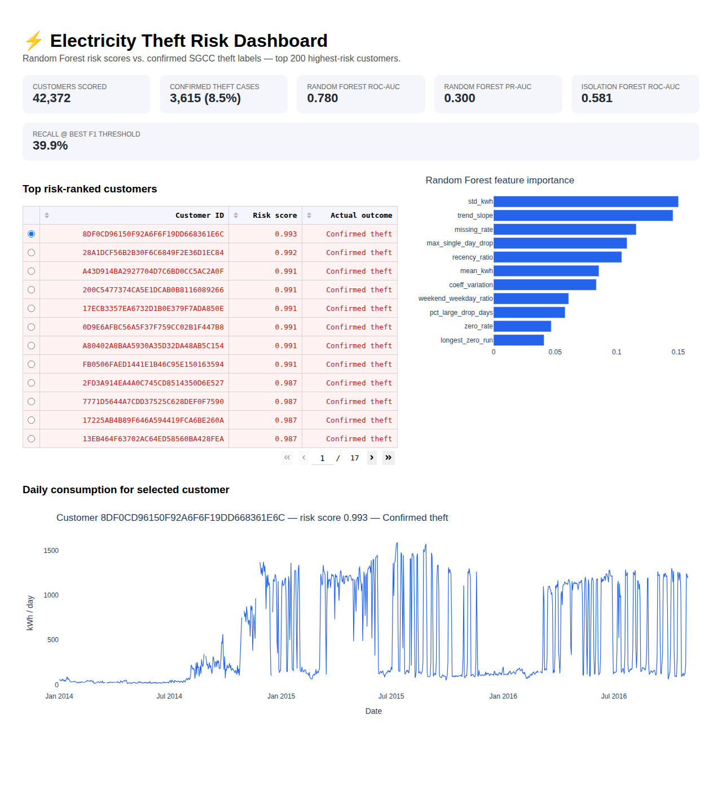

# ⚡ Electricity Theft Detection

Detecting electricity theft using the SGCC labeled smart-meter dataset — a direct follow-up to [utility-anomaly-detection](https://github.com/JM-Bunagan-22/utility-anomaly-detection), this time with **ground-truth fraud labels** instead of unsupervised guesswork, so the models can be scored properly.

## Problem
[utility-anomaly-detection](https://github.com/JM-Bunagan-22/utility-anomaly-detection) flagged anomalous days using rolling z-scores and Isolation Forest on a single unlabeled household — useful for surfacing *something worth a look*, but with no way to know if the flagged periods were actually fraud. This project uses a dataset where the answer is known: 42,372 real Chinese utility customers, each labeled as confirmed electricity theft or normal, so detection methods can be evaluated with real precision/recall instead of just a flagged-day count.

## Approach
1. **Data**: [SGCC Electricity Theft Detection dataset](https://github.com/henryRDlab/ElectricityTheftDetection) (State Grid Corporation of China) — daily consumption for 42,372 customers from 2014-01-01 to 2016-10-31, each labeled `0` (normal) or `1` (confirmed theft). ~8.5% of customers are labeled theft.
2. **Feature engineering**: per-customer features built from each ~1,035-day consumption history — mean/std/coefficient of variation, missing-data rate, zero-reading rate and longest zero streak, largest single-day drop, % of days with a large drop, weekend/weekday ratio, consumption trend slope, and a first-half-vs-second-half recency ratio.
3. **Detection**: train a **Random Forest classifier** on the labels (supervised) and an **Isolation Forest** (unsupervised, never sees the labels) on the same features, then score both against the held-out ground truth.
4. **Visualization**: a Dash dashboard ranking customers by theft risk score, with a consumption chart per customer so a reviewer can see the pattern behind the score (e.g. a meter that goes flat or erratic mid-history).

## Result
On a held-out 25% test set (10,593 customers, 8.5% theft rate):

| Model | ROC-AUC | PR-AUC | Precision (theft) | Recall (theft) | F1 (theft) |
|---|---|---|---|---|---|
| Random Forest (supervised) | **0.780** | **0.300** | 0.313 | 0.399 | 0.351 |
| Isolation Forest (unsupervised) | 0.581 | 0.109 | — | — | — |

The supervised model clearly outperforms the unsupervised baseline (ROC-AUC 0.78 vs. 0.58, PR-AUC nearly 3x higher) — confirming the tradeoff the first project could only speculate about: unsupervised anomaly scores are a reasonable first pass when no labels exist, but once any confirmed fraud cases are available, even a modest supervised model captures far more signal. The most predictive features were `std_kwh`, `trend_slope`, and `missing_rate` — theft cases tend to show unstable consumption, a declining trend (tampering that under-reports over time), and gaps in the meter's readings, more than they show outright zeros.

At the best F1 threshold, the Random Forest catches **40% of confirmed theft cases** while keeping **31% precision** — meaning roughly 1 in 3 flagged accounts is a real theft case, a workable hit rate for a human-reviewed shortlist out of 42k customers.



## Stack
Python · pandas · scikit-learn · Dash · Plotly

## Project Structure
```
electricity-theft-detection/
├── data/                    # raw and processed data (gitignored, not committed)
├── src/
│   ├── data_loader.py       # download & join the multi-part SGCC archive
│   ├── features.py          # per-customer feature engineering
│   ├── theft_detection.py   # Random Forest vs. Isolation Forest, metrics
│   └── dashboard.py         # Dash app
├── notebooks/                # exploratory analysis
├── assets/                   # dashboard screenshot for README
└── requirements.txt
```

## Setup
```bash
git clone https://github.com/JM-Bunagan-22/electricity-theft-detection.git
cd electricity-theft-detection
pip install -r requirements.txt

# 7z is required to join the dataset's 3-part split archive
apt-get install -y p7zip-full   # or: brew install p7zip

python src/data_loader.py       # downloads & reshapes the dataset (~52 MB download, ~175 MB extracted)
python src/features.py          # builds the per-customer feature matrix
python src/theft_detection.py   # trains both models, prints & saves metrics
python src/dashboard.py         # launches Dash app at localhost:8050
```

## Next Steps
- [ ] Try gradient-boosted trees (XGBoost/LightGBM) against the Random Forest baseline
- [ ] Add SHAP explanations per flagged customer for the dashboard, not just global feature importance
- [ ] Engineer sequence-aware features (e.g. an LSTM/CNN over the raw daily series, as in the original SGCC paper) to see how much the hand-built features are leaving on the table
- [ ] Calibrate the risk threshold against a cost model (investigation cost vs. recovered revenue) instead of optimizing F1
